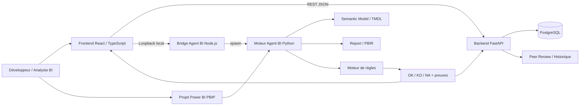
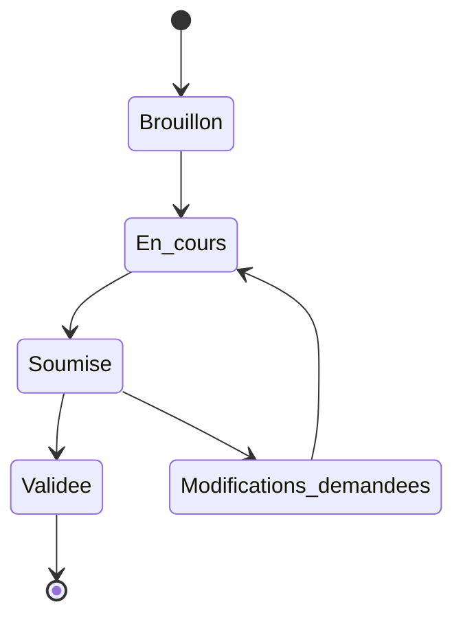

<div align="center">

# Best Practices Colas

### Plateforme de gouvernance, Peer Review & Agent BI pour Power BI

**Standardiser les bonnes pratiques, automatiser les contrôles et rendre les revues Power BI plus fiables, traçables et reproductibles.**

[](#vision-du-projet)
[](./frontend)
[](./Backend/pr_review_backend/pr_review_backend)
[](./Agent_BI)
[](./Agent_BI/README_Agent_BI.md)
[](#statut-du-projet)

</div>

> [!IMPORTANT]
> Ce dépôt présente un **projet personnel développé à partir d'un cas d'usage rencontré dans un contexte de stage chez Colas Digital Solutions**.
>
> Il ne constitue ni une publication officielle de Colas, ni une solution de production validée par l'entreprise. Le dépôt est public : aucune donnée métier confidentielle, aucun secret et aucun document interne non autorisé ne doivent y être versionnés.

---

## Sommaire

- [Présentation](#présentation)
- [Contexte et problématique](#contexte-et-problématique)
- [Vision du projet](#vision-du-projet)
- [Objectifs](#objectifs)
- [Ce que la solution apporte](#ce-que-la-solution-apporte)
- [Architecture globale](#architecture-globale)
- [Agent BI](#agent-bi)
- [Plateforme de Peer Review](#plateforme-de-peer-review)
- [Frontend](#frontend)
- [Backend](#backend)
- [Stack technique](#stack-technique)
- [Structure du dépôt](#structure-du-dépôt)
- [Démarrage rapide](#démarrage-rapide)
- [Tests](#tests)
- [Sécurité et gouvernance](#sécurité-et-gouvernance)
- [État actuel](#état-actuel)
- [Roadmap](#roadmap)
- [Documentation](#documentation)
- [Ce que ce projet démontre](#ce-que-ce-projet-démontre)
- [Auteur](#auteur)
- [Licence](#licence)

---

# Présentation

**Best Practices Colas** est un projet de gouvernance Power BI conçu pour répondre à une problématique concrète : rendre les revues de rapports et de modèles Power BI plus **standardisées, fiables, explicables et traçables**.

Le projet est né dans le cadre de mon stage de **Data Analyst chez Colas Digital Solutions**, pendant lequel je me suis intéressé à la manière d'intégrer et d'industrialiser la gouvernance tout au long du cycle de vie des produits Power BI.

L'idée initiale était simple :

> Comment éviter qu'une revue Power BI repose uniquement sur des fichiers Excel, des contrôles manuels et des échanges dispersés, tout en conservant une véritable preuve de ce qui a été vérifié ?

Le projet a progressivement évolué vers une architecture plus complète réunissant :

- un **référentiel de bonnes pratiques** ;
- une **plateforme de Peer Review** ;
- un **backend de gouvernance et de traçabilité** ;
- un **frontend React / TypeScript** ;
- un **moteur Python de règles déterministes** ;
- un **Agent BI** capable d'analyser les métadonnées d'un projet Power BI ;
- une **couche agentique gouvernée** pour les contrôles nécessitant réellement du contexte ou de l'interprétation.

---

# Contexte et problématique

Dans une organisation où plusieurs produits Power BI sont développés, faire respecter les bonnes pratiques devient rapidement un sujet de gouvernance.

Une revue manuelle peut devenir difficile à industrialiser lorsque :

- plusieurs versions du référentiel circulent ;
- les contrôles sont réalisés différemment selon la personne ;
- les résultats sont stockés dans différents fichiers Excel ;
- les preuves techniques sont difficiles à retrouver ;
- les validations et corrections sont dispersées dans plusieurs outils ;
- les évolutions d'une règle ne sont pas historisées ;
- les mêmes vérifications sont répétées manuellement à chaque nouveau rapport.

La problématique qui structure ce projet est donc :

> **Comment intégrer et industrialiser la gouvernance tout au long du cycle de vie des produits Power BI afin de standardiser les pratiques, garantir la fiabilité des données et assurer la traçabilité des évolutions ?**

Best Practices Colas constitue une réponse expérimentale et technique à cette problématique.

---

# Vision du projet

La vision cible consiste à construire une chaîne de gouvernance dans laquelle les contrôles techniques objectivables sont automatisés et les décisions humaines restent traçables.

```text
Développement Power BI
        |
        v
Projet PBIP / Modèle / Rapport
        |
        v
Analyse automatique Agent BI
        |
        v
Preuves techniques
        |
        +------------------+
        |                  |
        v                  v
Contrôles déterministes   Analyse contextuelle
Python                    Skills / Agent
        |                  |
        +---------+--------+
                  |
                  v
              OK / KO / NA
                  |
                  v
             Peer Review
                  |
                  v
       Remédiation / Validation
                  |
                  v
          Historique / Audit
```

Le projet repose sur une séparation volontaire entre :

```text
CE QUI EST OBJECTIVABLE
        |
        v
Code déterministe

CE QUI NÉCESSITE DU JUGEMENT
        |
        v
Agent / Skill
```

Cette séparation est essentielle pour préserver la reproductibilité des contrôles.

---

# Objectifs

Le projet poursuit plusieurs objectifs complémentaires.

## Gouvernance

Centraliser les règles et garantir que chaque revue soit associée à la version exacte du référentiel utilisée.

## Qualité

Automatiser progressivement les contrôles techniques les plus répétitifs afin de réduire les erreurs de revue.

## Traçabilité

Conserver les résultats, preuves, validations et évolutions d'une revue.

## Explicabilité

Un statut `OK`, `KO` ou `NA` doit pouvoir être justifié par une preuve.

## Industrialisation

Faire évoluer une checklist manuelle vers une architecture exploitable par une application.

## Extensibilité

Permettre l'ajout progressif de nouvelles bonnes pratiques sans devoir réécrire l'ensemble du moteur.

## QCD

L'Agent BI est également pensé autour du triangle :

```text
Qualité
Coût
Délais
```

L'automatisation ne doit pas dégrader la qualité des contrôles simplement pour gagner du temps.

---

# Ce que la solution apporte

La solution s'articule autour de quatre fonctions principales.

### 1. Gérer un référentiel de bonnes pratiques

Chaque règle peut être versionnée, documentée et historisée.

### 2. Réaliser une Peer Review

Une revue permet d'évaluer un produit Power BI, de suivre les écarts et de préparer les corrections.

### 3. Automatiser les contrôles techniques

Agent BI inspecte les métadonnées Power BI et produit des résultats déterministes.

### 4. Conserver les preuves

Chaque contrôle doit idéalement produire :

```text
Rule ID
Object
Expected
Actual
Evidence
Status
Reason
Location      (fichier + ligne + extrait)
Explanation   (pourquoi c'est un problème)
Remediation   (quoi changer)
```

---

# Architecture globale



---

# Agent BI

## Rôle

Agent BI est le moteur d'analyse automatique du projet.

Son objectif est de lire un projet Power BI au format **PBIP**, d'extraire les informations utiles et d'exécuter les bonnes pratiques compatibles avec une analyse déterministe.

Il peut travailler sur deux grandes zones :

```text
Projet PBIP
    |
    +--------------------------+
    |                          |
    v                          v
Semantic Model               Report
    |                          |
    v                          v
TMDL                        PBIR / JSON
```

---

## Principe de décision

Chaque règle retourne un des trois statuts suivants :

| Statut | Signification |
|---|---|
| `OK` | La conformité est démontrée |
| `KO` | La non-conformité est démontrée |
| `NA` | Les informations disponibles ne permettent pas de conclure de manière fiable |

Le moteur suit volontairement une logique asymétrique :

```text
Pas de preuve
    ≠
KO
```

Si une propriété nécessaire n'est pas accessible ou ne peut pas être interprétée correctement, la règle doit privilégier `NA` plutôt qu'inventer une non-conformité.

---

## Règles implémentées

Le moteur exécute actuellement **15 bonnes pratiques**, sur le modèle sémantique comme sur le rapport.

| Règle | Bonne pratique | Périmètre |
|---|---|---|
| `BP-03` | Éviter les relations bidirectionnelles et many-to-many | Modèle |
| `BP-07` | Éliminer les colonnes visibles et inutilisées du modèle | Modèle + Rapport |
| `BP-09` | Désactiver l'option Auto Date/Time | Modèle |
| `BP-10` | Utiliser des clés de relation entières | Modèle |
| `BP-11` | Vérifier les types de données et la précision numérique | Modèle |
| `BP-15` | Maximiser le query folding vers la source | Power Query |
| `BP-17` | Utiliser un SQL Warehouse pour Databricks en DirectQuery | Power Query |
| `BP-21` | Noms d'objets concis, cohérents et conformes à la convention | Modèle |
| `BP-22` | Désactivation de l'autosummarization | Modèle |
| `BP-25` | Masquer les champs techniques démontrés | Modèle |
| `BP-32` | Utiliser des mesures explicites plutôt que des agrégations implicites | DAX + Rapport |
| `BP-37` | Organiser les visuels et les signets | Rapport |
| `BP-38` | Éliminer les interactions croisées inutiles | Rapport |
| `BP-39` | Configurer et tester les filtres du rapport | Rapport |
| `BP-41` | Détection des visuels redondants ou dupliqués | Rapport (candidats) |

### Portées partielles assumées

Cinq de ces règles couvrent volontairement une partie seulement de leur algorithme, documentée en tête du fichier Python correspondant. Elles ne doivent pas être « complétées » par une heuristique : ce qui manque exige une information que le projet PBIP ne contient pas.

```text
BP-15   branches statiques seules  (aucune preuve runtime dans un PBIP)
BP-25   voie « clé de tri exclusive » seule
BP-37   sous-contrôle structurel seul
BP-38   cohérence technique des références seule
BP-39   validation des références de filtres seule
```

### Le plafond n'est pas un manque de parseur

Les bonnes pratiques restantes ne sont pas bloquées par les parseurs, mais par l'absence d'une **source de règles d'entreprise versionnée** : seuils de volumétrie, glossaire des champs ambigus, conventions de nommage attendues, contrats de notification.

```text
Parseur supplémentaire
    -> ne débloque presque rien

Référentiel de policy versionné
    -> débloquerait une dizaine de règles
```

C'est donc une décision de gouvernance, pas un sujet technique.

---

## Candidats : quand le déterministe s'arrête

Certaines bonnes pratiques ne peuvent pas être tranchées par du code seul sans produire de faux positifs. Répéter un même KPI sur plusieurs pages, par exemple, est très souvent légitime.

Pour ces cas, le moteur produit des **candidats** plutôt qu'un verdict :

```text
Détection déterministe
        |
        v
    Candidat
        |
        v
Revue contextuelle (skill / humain)
        |
        v
JUSTIFIE | NON_CONFORME_CONFIRME | NON_RESOLU
```

Le principe est strict :

```text
candidat ≠ violation
```

Une règle qui n'émet que des candidats reste donc `NA` et ne fait jamais chuter le score tant que la revue contextuelle n'a rien qualifié. `BP-41` est la première règle construite sur ce modèle.

---

## Architecture fonctionnelle

```text
Agent_BI/
|
├── 01_ALGORITHMES/
├── 02_SKILLS/
├── 03_PYTHON/
├── 05_NODE/
├── ALGORITHMIE_AGENT_BI_v1.md
├── Agent_BI_Algorithmie_Regles_v1.xlsx
└── README_Agent_BI.md
```

### `01_ALGORITHMES`

Contient la définition fonctionnelle des bonnes pratiques.

Une règle doit préciser :

```text
Bonne pratique
      |
      v
Périmètre
      |
      v
Source
      |
      v
Propriété
      |
      v
Conditions
      |
 +----+----+
 |    |    |
 v    v    v
OK   KO   NA
```

L'algorithme décrit **ce que la règle doit faire**, indépendamment du langage qui l'implémente.

---

## `03_PYTHON`

Le moteur Python prend en charge :

- la découverte du projet PBIP ;
- la lecture du modèle sémantique et du rapport ;
- le parsing TMDL, PBIR, Power Query (M) et DAX ;
- l'indexation des usages d'un champ dans le rapport ;
- la construction d'un contexte partagé ;
- l'exécution des règles ;
- la génération des résultats ;
- la production des preuves ;
- les futures corrections automatisées.

Architecture :

```text
03_PYTHON/
|
├── main.py
├── engine/
│   ├── context.py       lecture unique du projet
│   ├── models.py        Finding / Candidate / RuleResult
│   ├── runner.py        exécution des règles
│   ├── envelope.py      contrat JSON versionné
│   └── usage_index.py   où chaque champ est réellement utilisé
├── powerbi/
│   ├── tmdl_parser.py   modèle sémantique (TMDL)
│   ├── pbir_parser.py   rapport (PBIR / JSON)
│   ├── m_lang.py        Power Query (code M)
│   └── dax_lang.py      expressions DAX
├── rules/
├── fixes/
└── tests/
```

Les parseurs sont volontairement séparés des règles : une règle décrit une décision métier, jamais la façon de lire un fichier.

### Lecture unique du projet

Les règles ne doivent pas chacune reparcourir le projet.

```text
PBIP
 |
 v
AnalysisContext
 |
 +-------------------------------+
 |               |               |
 v               v               v
BP-01           BP-02           BP-N
 |               |               |
 v               v               v
OK              KO              NA
```

Cette architecture évite de multiplier les lectures disque lorsque le nombre de bonnes pratiques augmente.

---

## Règle de référence : BP-22

`BP-22` reste la règle de référence du moteur : c'est celle sur laquelle la convention d'implémentation a été fixée, et celle à lire en premier avant d'en écrire une nouvelle.

### Désactivation de l'autosummarization

Le moteur parcourt :

```text
<Project>.SemanticModel/
└── definition/
    └── tables/
        └── <TABLE>.tmdl
```

Pour chaque colonne, il analyse principalement :

```text
summarizeBy
```

Décision :

```text
summarizeBy: none
    -> OK

summarizeBy présent avec une autre valeur
    -> KO

summarizeBy absent, illisible ou inconnu
    -> NA
```

L'annotation :

```text
SummarizationSetBy
```

reste informative et ne pilote pas la décision de cette règle.

---

## Explicabilité d'un constat

Un statut ne suffit pas : un écart doit pouvoir être compris et corrigé sans jamais rouvrir le projet Power BI.

Chaque constat porte donc, en plus de la preuve technique :

```text
location      fichier + ligne exacte + extrait du code fautif
explanation   pourquoi c'est un problème
remediation   quoi changer, concrètement
```

C'est ce qui permet au frontend d'afficher une preuve lisible alors que le projet PBIP ne quitte jamais le poste de l'utilisateur.

---

## Exemple de résultat

```json
{
  "schema_version": "1.0",
  "engine_version": "0.1.0",
  "project": {
    "name": "MyProject",
    "format": "PBIP",
    "project_path": "C:\\Project",
    "semantic_model_path": "C:\\Project\\MyProject.SemanticModel",
    "fingerprint": "sha256:..."
  },
  "results": [
    {
      "rule_id": "BP-22",
      "rule_name": "Désactivation de l'autosummarization",
      "execution_status": "SUCCESS",
      "rule_status": "KO",
      "findings": [
        {
          "rule_id": "BP-22",
          "object_type": "column",
          "object": "D_CAMPAIGNS.CAMPAIGN_SHORT_LABEL",
          "expected": "summarizeBy = none",
          "actual": "count",
          "status": "KO",
          "evidence": {
            "table": "D_CAMPAIGNS",
            "column": "CAMPAIGN_SHORT_LABEL",
            "source_file": "...\\definition\\tables\\D_CAMPAIGNS.tmdl"
          },
          "reason": "Valeur différente de none",
          "location": {
            "source_file": "...\\definition\\tables\\D_CAMPAIGNS.tmdl",
            "line": 37,
            "end_line": 37,
            "excerpt": "\t\tsummarizeBy: count"
          },
          "explanation": "Power BI agrège automatiquement cette colonne dès qu'elle est glissée dans un visuel. Le calcul n'est écrit nulle part : il ne peut être ni relu, ni réutilisé, ni corrigé de façon centralisée.",
          "remediation": "Remplacer `summarizeBy: count` par `summarizeBy: none` (ligne 37). Si l'agrégation est réellement voulue, créer une mesure DAX explicite."
        }
      ]
    }
  ]
}
```

Un `KO` est un résultat métier valide et non une erreur d'exécution.

Une règle qui produit des candidats ajoute une clé `candidates`, absente partout ailleurs — une clé vide laisserait croire qu'une revue contextuelle est attendue :

```json
{
  "rule_id": "BP-41",
  "rule_status": "NA",
  "candidates": [
    {
      "rule_id": "BP-41",
      "candidate_id": "DUP-00b8b90a",
      "candidate_type": "DUPLICATE_VISUAL",
      "objects": [
        { "page_id": "...", "visual_id": "...", "is_hidden": true, "parent_group": "..." }
      ],
      "technical_evidence": {
        "visual_type": "slicer",
        "field_references": ["Column:D_USERS[USER_AREA]"],
        "occurrence_count": 6
      },
      "review_context": {
        "same_page": false,
        "distinct_page_count": 6,
        "all_hidden": false,
        "question": "Cette répétition est-elle un rappel volontaire (volet de navigation, KPI de synthèse) ou une duplication à supprimer ?"
      }
    }
  ]
}
```

---

# Skills et couche agentique

Les skills n'ont pas vocation à remplacer les règles déterministes.

Ils servent aux tâches où un modèle apporte réellement de la valeur.

Les skills actuellement structurés dans `.claude/skills/` couvrent notamment :

- Rule Engineering ;
- Rule Review ;
- BPA mapping ;
- analyse contextuelle ;
- préparation des corrections ;
- génération de tests ;
- création et évolution de skills ;
- sourcing de preuve sur les formats Power BI ;
- revue adverse d'un verdict avant qu'il ne tienne.

Le principe reste :

```text
Déterministe
    -> Python

Contextuel / interprétatif
    -> Skill
```

Le passage de l'un à l'autre est explicite dans le contrat JSON : le moteur émet des `candidates`, que le skill `agent-bi-context-review` qualifie. Le skill reçoit la preuve technique comme un **fait acquis** — il arbitre le contexte, il ne rejoue pas la détection.

---

# Bridge Node local

`Agent_BI/05_NODE` permet à un frontend d'appeler le moteur Python local.

Architecture :

```text
Navigateur
    |
    v
127.0.0.1:27841
    |
    v
Node.js
    |
    v
Python Agent BI
```

Le bridge implémente :

```text
GET  /api/v1/health
POST /api/v1/pairing/request
POST /api/v1/pairing/confirm
POST /api/v1/analyses
GET  /api/v1/analyses/{id}
```

### Principes de sécurité

- écoute uniquement sur `127.0.0.1` ;
- appairage explicite ;
- jeton obligatoire pour lancer une analyse ;
- code d'appairage affiché localement ;
- validation du chemin du projet ;
- lancement de Python avec `spawn(...)` ;
- aucune utilisation de `shell: true`.

---

# Plateforme de Peer Review

L'Agent BI ne remplace pas la Peer Review.

Il l'alimente.

La plateforme permet d'encadrer tout ce qui relève du suivi, de la collaboration et de la gouvernance.

---

## Référentiel versionné

Chaque règle possède une identité stable et peut évoluer au travers de versions immuables.

Une revue conserve les versions exactes utilisées au moment de sa création.

```text
Rule
 |
 +--> Version 1
 |
 +--> Version 2
 |
 +--> Version N
```

Une ancienne revue ne doit donc jamais être recalculée silencieusement avec une nouvelle version de règle.

---

## Cycle d'une revue



---

## Scoring

Le système historique de Peer Review peut utiliser les statuts :

```text
OK
KO
Partiel
N/A
Non renseigné
```

Le score est calculé sur les éléments réellement évalués :

```text
évalués = OK + KO + Partiel

score =
(OK + 0.5 × Partiel)
--------------------
      évalués
        × 100
```

`N/A` et `Non renseigné` sont exclus du dénominateur.

---

# Frontend

Le dépôt contient désormais un frontend React / TypeScript dédié.

Technologies :

- React 19 ;
- React DOM ;
- React Router ;
- TanStack Query ;
- TypeScript ;
- Vite.

Configuration API :

```env
VITE_API_BASE_URL=http://localhost:8000/api/v1
```

Le frontend a vocation à devenir l'interface principale réunissant progressivement :

- référentiel ;
- revues ;
- historique ;
- administration ;
- résultats Agent BI ;
- remédiations ;
- validation.

## Parcours Agent BI depuis l'interface

Le composant `AgentConnectPanel`, affiché sur une revue Power BI, relie l'interface au moteur local :

```text
Détection de l'agent sur 127.0.0.1
        |
        v
Appairage par code à 6 chiffres
        |
        v
Saisie du chemin du projet PBIP
        |
        v
Analyse (Node -> Python) + polling
        |
        v
Aperçu des statuts par règle
        |
        v
« Appliquer à la revue » -> backend
```

Le projet Power BI n'est jamais téléversé : seuls les résultats et leurs preuves remontent au backend.

---

# Backend

Le backend de la plateforme repose sur **FastAPI**.

Il prend notamment en charge :

- les utilisateurs ;
- l'authentification ;
- les rôles ;
- le référentiel ;
- les règles ;
- les versions ;
- les revues ;
- les review items ;
- le partage ;
- les validations ;
- les imports ;
- le matching ;
- les intégrations ;
- l'audit.

---

## Authentification

Le backend prévoit :

```text
Microsoft Entra ID / OIDC
            |
            +--> authentification principale

Email + mot de passe
            |
            +--> fallback local
```

Les mots de passe du fallback sont protégés avec Argon2id.

---

## Base de données

Stack :

```text
PostgreSQL
    |
    v
SQLAlchemy
    |
    v
Alembic
```

Les migrations permettent de faire évoluer le schéma de façon contrôlée.

---

## Import et matching

Le backend contient également une architecture d'import permettant de rapprocher des informations issues de fichiers Excel avec le référentiel.

Le moteur local utilise notamment :

- normalisation ;
- synonymes ;
- pondération ;
- similarité ;
- seuils de confiance.

Les correspondances ambiguës doivent rester visibles pour validation humaine.

---

## Application des résultats Agent BI

Contrairement à l'import Excel, le rapprochement règle ↔ item est ici **déterministe** (via le code de la règle) : pas de fichier stocké, pas de matching flou, traitement synchrone.

Trois invariants protègent la revue :

```text
1. Un statut saisi par un humain n'est jamais écrasé
   -> il est signalé comme conflit

2. Réappliquer le même résultat sur le même état de projet
   -> no-op, pas une réécriture

3. Le score est recalculé une seule fois, après le lot complet
```

L'empreinte du projet (`fingerprint`) est conservée avec chaque item : c'est elle qui permet de savoir si un résultat correspond toujours à l'état analysé.

---

# Stack technique

| Domaine | Technologies |
|---|---|
| BI | Power BI, PBIP, TMDL, PBIR |
| Frontend | React 19, TypeScript, Vite, React Router, TanStack Query |
| Backend | Python, FastAPI, Pydantic |
| Data | PostgreSQL, SQLAlchemy |
| Migrations | Alembic |
| Agent BI | Python |
| Bridge local | Node.js |
| Tests Python | pytest |
| Tests Node | Node Test Runner |
| Auth | Microsoft Entra ID, OIDC, JWT, Argon2id |
| Import Excel | openpyxl |
| Matching | rapidfuzz, `pg_trgm` |
| Microsoft 365 | Microsoft Graph API |
| Conteneurisation | Docker, Docker Compose |
| DevOps | Git, GitHub, branches, Pull Requests |
| Cloud cible | Azure |

---

# Structure du dépôt

```text
Best_Practices_Colas/
|
├── .github/
│   ├── copilot-instructions.md
│   ├── instructions/
│   └── skills/
│       ├── agent-bi-bpa-mapper/
│       ├── agent-bi-context-review/
│       ├── agent-bi-fix-planner/
│       ├── agent-bi-rule-engineer/
│       ├── agent-bi-rule-review/
│       ├── agent-bi-skill-creator/
│       └── agent-bi-test-generator/
│
├── Agent_BI/
│   ├── 01_ALGORITHMES/
│   ├── 02_SKILLS/
│   ├── 03_PYTHON/
│   │   ├── engine/
│   │   │   ├── context.py
│   │   │   ├── models.py
│   │   │   ├── runner.py
│   │   │   ├── envelope.py
│   │   │   └── usage_index.py
│   │   ├── fixes/
│   │   ├── powerbi/
│   │   │   ├── tmdl_parser.py
│   │   │   ├── pbir_parser.py
│   │   │   ├── m_lang.py
│   │   │   └── dax_lang.py
│   │   ├── rules/
│   │   │   ├── registry.py
│   │   │   └── bp_*.py
│   │   ├── tests/
│   │   │   └── fixtures/
│   │   ├── main.py
│   │   └── requirements.txt
│   ├── 05_NODE/
│   │   ├── services/
│   │   ├── tests/
│   │   ├── package.json
│   │   └── server.js
│   ├── ALGORITHMIE_AGENT_BI_v1.md
│   ├── Agent_BI_Algorithmie_Regles_v1.xlsx
│   └── README_Agent_BI.md
│
├── Backend/
│   ├── Spec_Backend_PR_Review.md
│   ├── Spec_Backend_PR_Review.html
│   ├── pbi-agent-overlay-v2.js
│   └── pr_review_backend/
│       └── pr_review_backend/
│           ├── app/
│           ├── alembic/
│           ├── tests/
│           ├── Dockerfile
│           ├── docker-compose.yml
│           ├── requirements.txt
│           ├── .env.example
│           └── README.md
│
├── frontend/
│   ├── src/
│   │   ├── api/
│   │   ├── auth/
│   │   ├── components/
│   │   ├── pages/
│   │   └── types.ts
│   ├── .env.example
│   ├── index.html
│   ├── package.json
│   ├── package-lock.json
│   ├── tsconfig.json
│   └── vite.config.ts
│
├── PR_Review_PowerBI_agent_scoring_v9.html
├── .gitignore
└── README.md
```

---

# Démarrage rapide

## Prérequis

Pour utiliser les principales briques du projet :

- Git ;
- Python ;
- Node.js 18+ ;
- npm ;
- Docker ;
- Docker Compose ;
- Power BI Desktop pour manipuler des projets PBIP réels.

---

## Cloner le dépôt

```bash
git clone https://github.com/dataphil971/Best_Practices_Colas.git
cd Best_Practices_Colas
```

---

## Backend

```bash
cd Backend/pr_review_backend/pr_review_backend
```

### Windows PowerShell

```powershell
Copy-Item .env.example .env
docker compose up --build
```

### Linux / macOS

```bash
cp .env.example .env
docker compose up --build
```

API :

```text
http://localhost:8000
```

Swagger :

```text
http://localhost:8000/docs
```

---

## Frontend

```bash
cd frontend
npm install
```

### Windows PowerShell

```powershell
Copy-Item .env.example .env
npm run dev
```

### Linux / macOS

```bash
cp .env.example .env
npm run dev
```

Build :

```bash
npm run build
```

---

## Agent BI Python

```bash
cd Agent_BI/03_PYTHON
```

### Windows PowerShell

```powershell
python -m venv .venv
.\.venv\Scripts\Activate.ps1
pip install -r requirements.txt
```

Puis :

```powershell
python main.py "C:\chemin\vers\mon_projet_pbip"
```

Le dossier doit contenir un projet du type :

```text
MyProject/
|
├── MyProject.pbip
├── MyProject.SemanticModel/
└── MyProject.Report/
```

---

## Bridge Node Agent BI

```bash
cd Agent_BI/05_NODE
npm install
npm start
```

Port local par défaut :

```text
127.0.0.1:27841
```

---

# Tests

Chaque brique possède sa propre suite. Les règles Agent BI sont testées sur des fixtures TMDL / PBIR minimales, et le moteur est régulièrement rejoué sur un projet Power BI réel — c'est ce qui a permis de détecter les écarts que des fixtures écrites à la main ne révèlent jamais.

## Backend

```bash
cd Backend/pr_review_backend/pr_review_backend
pytest
```

## Agent BI

```bash
cd Agent_BI/03_PYTHON
pytest
```

## Node bridge

```bash
cd Agent_BI/05_NODE
npm test
```

## Frontend

```bash
cd frontend
npx tsc --noEmit
npm run build
```

État des suites au dernier passage :

| Suite | Résultat |
|---|---|
| Agent BI (pytest) | 125 tests |
| Backend (pytest) | 50 tests |
| Bridge Node (node:test) | 5 tests |
| Frontend (typecheck + build) | OK |

---

# Sécurité et gouvernance

La gouvernance ne concerne pas uniquement les règles Power BI.

Elle concerne également la façon dont la solution elle-même est construite.

---

## Sécurité applicative

Le projet prévoit notamment :

- authentification ;
- RBAC ;
- JWT ;
- mots de passe Argon2id ;
- secrets hors du code ;
- journalisation ;
- validation des entrées ;
- isolation du bridge local ;
- limitation des accès ;
- séparation frontend / backend.

---

## Sécurité Agent BI

Le bridge local ne doit jamais être exposé sur le réseau.

```text
127.0.0.1
    ✅

0.0.0.0
    ❌
```

Les analyses nécessitent un appairage et un jeton.

---

## Confidentialité

Ce dépôt étant public, il ne doit contenir aucun :

- secret ;
- mot de passe ;
- token ;
- fichier `.env` réel ;
- fichier Power BI contenant des données confidentielles ;
- export métier non anonymisé ;
- donnée personnelle ;
- documentation interne non autorisée.

---

# État actuel

Le projet a dépassé le stade de simple maquette mais reste en phase d'industrialisation.

| Brique | État |
|---|---:|
| Référentiel / concept de Peer Review | ✅ |
| Prototype HTML | ✅ |
| Backend FastAPI | ✅ |
| Base PostgreSQL / migrations | ✅ |
| Authentification / RBAC | ✅ |
| Revues / scoring | ✅ |
| Validation tierce | ✅ |
| Imports / matching | ✅ |
| Frontend React | ✅ en développement |
| Agent BI — architecture | ✅ |
| Agent BI — moteur Python | ✅ |
| Agent BI — AnalysisContext | ✅ |
| Parsing TMDL | ✅ |
| Parsing PBIR (rapport) | ✅ |
| Parsing Power Query (M) et DAX | ✅ |
| Index d'usage des champs | ✅ |
| Contrat JSON | ✅ |
| Explicabilité (fichier, ligne, extrait, remédiation) | ✅ |
| 15 bonnes pratiques implémentées | ✅ |
| Règles à candidats (revue contextuelle) | ✅ |
| Tests des règles + fixtures | ✅ |
| Validation sur projet Power BI réel | ✅ |
| Bridge Node local | ✅ |
| Skills Agent BI | ✅ |
| Application des résultats à une revue | ✅ |
| Frontend ↔ Node ↔ Python | ✅ |
| Référentiel de policy d'entreprise | ⏳ |
| Bonnes pratiques dépendant d'une policy | ⏳ |
| Qualification automatisée des candidats | ⏳ |
| Auto-fix généralisé | ⏳ |
| CI/CD | ⏳ |
| Déploiement cloud | ⏳ |

---

# Roadmap

## Phase 1 — Gouvernance et Peer Review

- [x] Structurer le besoin
- [x] Formaliser le référentiel
- [x] Créer le prototype
- [x] Définir le workflow de validation
- [x] Définir le scoring

## Phase 2 — Backend

- [x] FastAPI
- [x] PostgreSQL
- [x] SQLAlchemy
- [x] Alembic
- [x] Authentification
- [x] RBAC
- [x] Revues
- [x] Référentiel
- [x] Validation
- [x] Imports

## Phase 3 — Frontend

- [x] Initialisation React / TypeScript
- [x] Vite
- [x] React Query
- [x] Écrans revues / détail / connexion
- [x] Panneau de connexion à l'Agent BI
- [ ] Brancher tous les écrans au backend
- [ ] Consolider la gestion d'état
- [ ] Ajouter la gestion complète de l'authentification
- [ ] Afficher les candidats et leur qualification

## Phase 4 — Agent BI

- [x] Architecture
- [x] Convention des règles
- [x] Moteur Python
- [x] AnalyseContext
- [x] TMDL
- [x] PBIR
- [x] Parseurs Power Query (M) et DAX
- [x] Index d'usage des champs
- [x] BP-22 puis 14 autres bonnes pratiques
- [x] Explicabilité des constats
- [x] Règles à candidats
- [x] Tests / fixtures
- [x] Validation sur projet Power BI réel
- [x] Bridge Node
- [ ] Formaliser un référentiel de policy versionné
- [ ] Implémenter les règles qui en dépendent
- [ ] Construire les fixes
- [ ] Ajouter dry-run / rollback

## Phase 5 — Intégration

- [x] Frontend ↔ Node
- [x] Node ↔ Python
- [x] Publication des résultats dans une revue
- [x] Préservation des statuts saisis par un humain
- [ ] Brancher l'ensemble des écrans au backend
- [ ] Historiser les analyses successives d'un même projet

## Phase 6 — Industrialisation

- [ ] GitHub Actions
- [ ] Tests d'intégration
- [ ] Tests de charge
- [ ] Observabilité
- [ ] Monitoring
- [ ] Sécurité renforcée
- [ ] Déploiement Azure

---

# Documentation

## Agent BI

- [README Agent BI](./Agent_BI/README_Agent_BI.md)
- [Algorithmie globale](./Agent_BI/ALGORITHMIE_AGENT_BI_v1.md)
- [Algorithmes des règles](./Agent_BI/01_ALGORITHMES)
- [Documentation Skills](./Agent_BI/02_SKILLS)
- [Moteur Python](./Agent_BI/03_PYTHON)
- [Bridge Node](./Agent_BI/05_NODE)
- [Catalogue Excel des règles](./Agent_BI/Agent_BI_Algorithmie_Regles_v1.xlsx)

## Backend

- [Spécification backend](./Backend/Spec_Backend_PR_Review.md)
- [Spécification backend HTML](./Backend/Spec_Backend_PR_Review.html)
- [README backend](./Backend/pr_review_backend/pr_review_backend/README.md)

## Interface

- [Frontend React](./frontend)
- [Prototype historique](./PR_Review_PowerBI_agent_scoring_v9.html)
- [Overlay Agent BI](./Backend/pbi-agent-overlay-v2.js)

---

# Ce que ce projet démontre

Au-delà du cas d'usage Power BI, ce projet me permet de travailler sur plusieurs dimensions complémentaires d'un produit data.

### Data & BI

- Power BI ;
- modélisation ;
- TMDL ;
- PBIP ;
- gouvernance ;
- qualité ;
- bonnes pratiques.

### Data Engineering

- traitement de métadonnées ;
- parsing ;
- normalisation ;
- pipelines d'analyse ;
- contrats de données ;
- orchestration.

### Software Engineering

- architecture modulaire ;
- API REST ;
- frontend / backend ;
- tests ;
- versionnement ;
- séparation des responsabilités.

### Agentic Engineering

- distinction déterministe / non déterministe ;
- skills spécialisés ;
- orchestration ;
- preuves ;
- analyse contextuelle ;
- préparation des corrections.

### Gouvernance

- référentiel versionné ;
- historique ;
- traçabilité ;
- validation ;
- RBAC ;
- audit.

### DevOps

- Git ;
- branches ;
- Pull Requests ;
- Docker ;
- configuration ;
- future CI/CD.

L'intérêt du projet n'est donc pas uniquement de construire un outil Power BI.

Il vise surtout à montrer comment un besoin de gouvernance peut être transformé progressivement en une **solution data et logicielle structurée**, en faisant le lien entre :

```text
Besoin métier
    |
    v
Règles de gouvernance
    |
    v
Architecture
    |
    v
Développement
    |
    v
Automatisation
    |
    v
Tests
    |
    v
Traçabilité
```

---

# Auteur

Projet conçu et développé par **Philippe Roumbo** — [dataphil971](https://github.com/dataphil971).

Je suis actuellement en fin de **Master Big Data & Business Intelligence** et ce projet a été initié dans le cadre de mon expérience de **Data Analyst chez Colas Digital Solutions**.

Il s'inscrit dans mon intérêt pour les sujets à l'intersection de :

- la Data Analytics ;
- la Business Intelligence ;
- la Data Engineering ;
- la gouvernance ;
- l'automatisation ;
- les systèmes agentiques.

---

# Licence

Aucune licence open source n'est actuellement définie dans le dépôt.

En l'absence de fichier `LICENSE`, tous les droits restent réservés à l'auteur.

Toute réutilisation doit également respecter les éventuelles contraintes de confidentialité, de propriété intellectuelle et de marque applicables aux éléments liés au contexte professionnel du projet.
