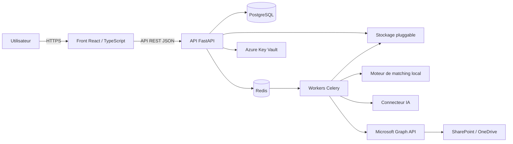
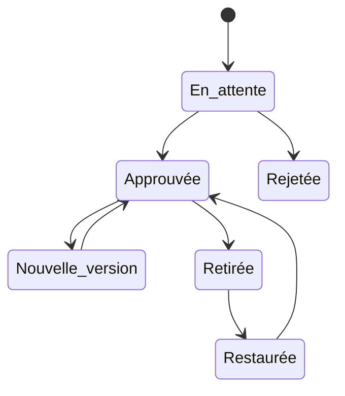
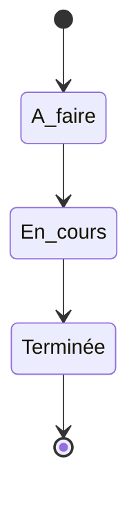

# Best Practices Colas

> Plateforme de **Peer Review Power BI** destinée à structurer, centraliser et sécuriser la revue des bonnes pratiques BI.


---

## Sommaire

- [Présentation](#présentation)
- [Objectifs](#objectifs)
- [Fonctionnalités](#fonctionnalités)
- [Architecture cible](#architecture-cible)
- [Rôles et permissions](#rôles-et-permissions)
- [Cycle de vie d'une revue](#cycle-de-vie-dune-revue)
- [Stack technique cible](#stack-technique-cible)
- [Structure du dépôt](#structure-du-dépôt)
- [Lancer le prototype](#lancer-le-prototype)
- [Feuille de route](#feuille-de-route)
- [Sécurité et gouvernance](#sécurité-et-gouvernance)
- [Documentation](#documentation)
- [Statut du projet](#statut-du-projet)
- [Auteur](#auteur)
- [Licence](#licence)

---

## Présentation

**Best Practices Colas** est un prototype de plateforme interne permettant d'accompagner la revue qualité de projets Power BI.

L'objectif est de remplacer une revue dispersée entre plusieurs fichiers, échanges et versions de référentiels par un processus centralisé permettant de :

- créer et compléter une revue ;
- évaluer un livrable à partir d'un référentiel de bonnes pratiques ;
- identifier les points conformes, partiels ou non conformes ;
- documenter les risques et les actions correctives ;
- soumettre une revue à un reviewer ;
- conserver un historique fiable des règles et des validations ;
- faciliter l'import et le rapprochement de données depuis Excel ou SharePoint.

Le principe central du projet est le **versionnement immuable des règles** : une revue conserve la version exacte de chaque règle utilisée au moment de son évaluation, même lorsque le référentiel évolue ensuite.

---

## Objectifs

### Objectifs métier

- Harmoniser les pratiques de revue Power BI.
- Améliorer la traçabilité des validations.
- Centraliser les référentiels de contrôle.
- Accélérer l'identification des écarts.
- Formaliser les plans de remédiation.
- Faciliter le partage entre auteurs, reviewers et administrateurs.

### Objectifs techniques

- Séparer clairement le front, l'API, les traitements asynchrones et le stockage.
- Garantir un contrôle d'accès fin grâce à un modèle RBAC.
- Permettre le changement de fournisseur d'IA ou de stockage sans redéploiement.
- Assurer l'auditabilité des actions sensibles.
- Préparer une intégration avec l'écosystème Microsoft :
  - Microsoft Entra ID ;
  - SharePoint ;
  - OneDrive ;
  - Microsoft Graph ;
  - Azure.

---

## Fonctionnalités

### Fonctionnalités présentes dans le dépôt

- Prototype d'interface de Peer Review Power BI.
- Parcours de navigation et de revue.
- Spécification technique complète du backend.
- Modèle de données PostgreSQL.
- Définition des endpoints REST.
- Modèle de permissions par rôle.
- Architecture d'import Excel et SharePoint.
- Stratégie de matching local et d'assistance par IA.
- Feuille de route de réalisation par lots.

### Fonctionnalités cibles

#### Gestion des revues

- Création et suivi d'une revue.
- Évaluation de chaque règle avec les statuts :
  - `OK` ;
  - `KO` ;
  - `Partiel` ;
  - `Non applicable` ;
  - `Non renseigné`.
- Calcul d'un score de conformité.
- Ajout de commentaires.
- Identification des risques.
- Proposition de solutions correctives.
- Suivi d'un plan de remédiation.
- Affectation d'un responsable.
- Définition d'une date cible.
- Recherche, tri et filtrage des revues.
- Export Excel formaté.

#### Référentiel versionné

- Gestion de plusieurs types de checklists :
  - Power BI ;
  - App BI ;
  - Build.
- Création et proposition de nouvelles règles.
- Approbation ou rejet par un administrateur.
- Historisation de chaque version.
- Conservation d'un snapshot immuable des règles.
- Retrait d'une règle sans suppression définitive.
- Restauration d'une règle retirée.
- Journal d'activité du référentiel.
- Recherche et export du référentiel.

#### Validation tierce

- Soumission d'une revue.
- Partage avec un ou plusieurs reviewers identifiés.
- Commentaires globaux.
- Commentaires par point de contrôle.
- Validation de la revue.
- Refus ou demande de modifications.
- Nouveau cycle de soumission après correction.

#### Import intelligent

- Import manuel de fichiers Excel.
- Analyse automatique du contenu.
- Rapprochement avec les règles du référentiel.
- Préremplissage des statuts.
- Signalement des correspondances ambiguës.
- Confirmation manuelle des cas incertains.
- Traitement asynchrone des imports volumineux.
- Synchronisation planifiée depuis SharePoint ou OneDrive.

#### Connecteurs configurables

- Moteur de matching local.
- IA Mistral par défaut.
- Possibilité d'utiliser :
  - une IA interne d'entreprise ;
  - OpenAI ;
  - Azure OpenAI.
- Stockage Azure Blob par défaut.
- Compatibilité avec :
  - Amazon S3 ;
  - MinIO ;
  - un stockage interne.
- Bascule du fournisseur actif depuis l'administration.
- Changement de fournisseur sans redéploiement.

---

## Architecture cible



### Principes d'architecture

- Le **front** consomme exclusivement l'API.
- Les autorisations sont vérifiées côté serveur.
- Les traitements longs passent par une file asynchrone.
- Le stockage est accessible via une interface commune.
- Les secrets ne sont jamais stockés dans le code.
- Les secrets ne sont jamais exposés au front.
- Les appels IA sont facultatifs.
- Un moteur de matching local reste disponible comme solution de repli.
- Chaque action sensible est enregistrée dans un journal d'audit.
- Le backend de stockage peut être changé sans modifier le reste de l'application.

---

## Rôles et permissions

| Fonctionnalité | Utilisateur | Reviewer | Administrateur |
|---|:---:|:---:|:---:|
| Créer et compléter ses revues | ✅ | ✅ | ✅ |
| Consulter ses propres revues | ✅ | ✅ | ✅ |
| Consulter une revue partagée | ✅ | ✅ | ✅ |
| Consulter toutes les revues | ❌ | ❌ | ✅ |
| Proposer une règle | ✅ | ✅ | ✅ |
| Valider ou refuser une revue | ❌ | ✅ | ✅ |
| Approuver ou rejeter une règle | ❌ | ❌ | ✅ |
| Reformuler une règle | ❌ | ❌ | ✅ |
| Retirer ou restaurer une règle | ❌ | ❌ | ✅ |
| Gérer les utilisateurs et les rôles | ❌ | ❌ | ✅ |
| Configurer l'IA | ❌ | ❌ | ✅ |
| Configurer le stockage | ❌ | ❌ | ✅ |
| Configurer SharePoint | ❌ | ❌ | ✅ |
| Consulter le journal complet d'activité | ❌ | ❌ | ✅ |

> Un reviewer ne peut consulter que les revues qui lui ont été explicitement partagées ou soumises.

> Seul l'administrateur dispose d'un accès global à l'ensemble des revues.

---

## Cycle de vie d'une revue


Les états prévus sont les suivants :

| État | Description |
|---|---|
| `draft` | La revue vient d'être créée |
| `in_progress` | La revue est en cours de remplissage |
| `submitted` | La revue a été soumise pour validation |
| `validated` | La revue a été validée |
| `changes_requested` | Des corrections ont été demandées |

### Cycle de vie d'une règle



### Cycle de vie d'une action de remédiation



Les états associés sont :

- `todo` ;
- `in_progress` ;
- `done`.

---

## Stack technique cible

| Couche | Technologie |
|---|---|
| Frontend | React, TypeScript, TanStack Query |
| API | Python 3.12, FastAPI, Pydantic |
| Base de données | PostgreSQL 16 |
| ORM | SQLAlchemy 2.x |
| Migrations | Alembic |
| Authentification | Microsoft Entra ID, OIDC |
| Authentification de repli | Email, mot de passe, Argon2id |
| Traitements asynchrones | Celery, Redis |
| Import Excel | openpyxl |
| Matching local | rapidfuzz |
| Recherche textuelle | PostgreSQL `pg_trgm` |
| IA | Mistral, IA interne, OpenAI ou Azure OpenAI |
| Stockage | Azure Blob, S3 ou stockage interne |
| Gestion des secrets | Azure Key Vault |
| Intégration Microsoft | Microsoft Graph API |
| Hébergement cible | Azure Container Apps ou AKS |
| Conteneurisation | Docker |

> Cette stack représente l'architecture cible décrite dans la spécification.

> Le dépôt contient actuellement le prototype front et les documents de conception, mais pas encore l'intégralité de l'implémentation backend.

---

## Modèle de données cible

Les principales entités prévues sont :

- `users` ;
- `categories` ;
- `rules` ;
- `rule_versions` ;
- `reviews` ;
- `review_items` ;
- `validations` ;
- `validation_item_comments` ;
- `share_links` ;
- `share_targets` ;
- `audit_log` ;
- `rule_activity` ;
- `import_jobs` ;
- `integration_config`.

### Principe de versionnement

Une règle possède :

- une identité stable dans `rules` ;
- plusieurs versions immuables dans `rule_versions` ;
- une seule version courante ;
- un historique conservé même après modification ou retrait.

Une revue référence directement la version de règle utilisée au moment de sa création.

Cela permet de garantir que les anciennes revues restent cohérentes, même lorsque le référentiel évolue.

---

## Structure du dépôt

```text
Best_Practices_Colas/
├── README.md
├── PR_Review_PowerBI.html
├── Spec_Backend_PR_Review.md
├── Spec_Backend_PR_Review.html
└── pr_review_backend_lot1.zip
```

| Fichier | Description |
|---|---|
| `README.md` | Présentation générale du projet |
| `PR_Review_PowerBI.html` | Prototype exécutable de l'interface de Peer Review |
| `Spec_Backend_PR_Review.md` | Spécification technique backend au format Markdown |
| `Spec_Backend_PR_Review.html` | Version HTML de la spécification backend |
| `pr_review_backend_lot1.zip` | Archive de travail associée au premier lot backend |

---

## Lancer le prototype

### 1. Cloner le dépôt

```bash
git clone https://github.com/dataphil971/Best_Practices_Colas.git
cd Best_Practices_Colas
```

### 2. Ouvrir le prototype sous Windows PowerShell

```powershell
Start-Process .\PR_Review_PowerBI.html
```

### Sous Linux

```bash
xdg-open PR_Review_PowerBI.html
```

### Sous macOS

```bash
open PR_Review_PowerBI.html
```

Le prototype s'exécute directement dans le navigateur et ne nécessite pas encore de serveur backend.

---

## Feuille de route

- [x] **MVP 1.0.0** — prototype du parcours de Peer Review.
- [x] **Spécification backend v1.2** — architecture, sécurité, API et modèle de données.
- [ ] **Lot 1** — fondations, migrations, authentification Entra ID et RBAC.
- [ ] **Lot 2** — référentiel versionné et workflow d'approbation.
- [ ] **Lot 3** — gestion complète des revues et score de conformité.
- [ ] **Lot 4** — partage ciblé et validation tierce.
- [ ] **Lot 5** — import intelligent et stockage pluggable.
- [ ] **Lot 6** — connecteurs IA configurables.
- [ ] **Lot 7** — synchronisation SharePoint.
- [ ] **Lot 8** — monitoring, audit et durcissement de la sécurité.

### Lot 1 — Fondations

- Mise en place du projet FastAPI.
- Configuration de PostgreSQL.
- Création des modèles SQLAlchemy.
- Création des migrations Alembic.
- Authentification Microsoft Entra ID.
- Provisioning automatique des utilisateurs.
- Mapping des groupes Entra vers les rôles.
- Mise en place du RBAC.
- Tests d'intégration.

### Lot 2 — Référentiel versionné

- Import initial du référentiel.
- Gestion des catégories.
- Création et modification des règles.
- Versionnement immuable.
- Approbation et rejet.
- Retrait et restauration.
- Journal d'activité.
- Recherche, tri et export.

### Lot 3 — Gestion des revues

- Création d'une revue avec snapshot des règles.
- Remplissage des points de contrôle.
- Calcul du score de conformité.
- Gestion des commentaires et remédiations.
- Recherche des revues.
- Export Excel.
- Suppression d'une revue.

### Lot 4 — Validation tierce

- Partage avec des reviewers ciblés.
- Liens de partage sécurisés.
- Validation ou demande de correction.
- Commentaires par point.
- Cycle de resoumission.

### Lot 5 — Import intelligent

- Import Excel.
- Parsing dans un worker asynchrone.
- Moteur de matching local.
- Préremplissage des statuts.
- Gestion des cas ambigus.
- Stockage pluggable.
- Test de connexion au stockage.

### Lot 6 — Intelligence artificielle

- Interface commune pour les fournisseurs d'IA.
- Intégration de Mistral.
- Intégration d'une IA interne.
- Compatibilité OpenAI.
- Compatibilité Azure OpenAI.
- Configuration depuis l'administration.
- Repli automatique vers le moteur local.

### Lot 7 — SharePoint

- Connexion à Microsoft Graph.
- Configuration des sources SharePoint.
- Détection des nouveaux fichiers.
- Synchronisation planifiée.
- Réutilisation du moteur d'import Excel.
- Notification des utilisateurs concernés.

### Lot 8 — Monitoring et sécurité

- Monitoring applicatif.
- Journalisation avancée.
- Rate limiting.
- Tests de charge.
- Tests de sécurité.
- Audit complet.
- Durcissement de la configuration de production.

---

## Sécurité et gouvernance

Le projet prévoit notamment :

- une authentification Microsoft Entra ID ;
- un contrôle d'accès RBAC côté serveur ;
- des access tokens de courte durée ;
- des refresh tokens sécurisés ;
- le hachage des mots de passe avec Argon2id en mode de repli ;
- des requêtes SQL paramétrées ;
- une validation stricte des fichiers importés ;
- une protection contre l'injection de formules Excel ;
- un stockage des secrets dans Azure Key Vault ;
- une journalisation immuable des actions sensibles ;
- le chiffrement TLS ;
- l'activation de HSTS ;
- une politique CORS restrictive ;
- une protection contre les attaques CSRF ;
- du rate limiting sur les endpoints sensibles ;
- une rétention configurable des fichiers importés ;
- une minimisation des données envoyées aux fournisseurs d'IA.

### Rétention des fichiers

Les fichiers Excel importés doivent être supprimés automatiquement après une durée configurable.

La durée envisagée par défaut est de :

```text
30 jours
```

Cette durée pourra être modifiée par un administrateur.

La suppression concernera :

- les fichiers importés ;
- les données techniques associées aux imports.

Elle ne concernera pas :

- les revues ;
- les résultats ;
- les historiques de validation ;
- les versions de règles.

### Bonnes pratiques pour contribuer

Ne jamais versionner :

- de mot de passe ;
- de jeton d'accès ;
- de clé API ;
- de chaîne de connexion ;
- de fichier `.env` réel ;
- de fichier Power BI contenant des données confidentielles ;
- de fichier Excel contenant des données sensibles ;
- d'informations personnelles non anonymisées ;
- d'informations internes non autorisées.

### Exemple de fichier `.gitignore`

```gitignore
# Variables d'environnement
.env
.env.*
!.env.example

# Python
__pycache__/
*.py[cod]
*.pyo
*.pyd
.venv/
venv/
env/

# Node
node_modules/
dist/
build/

# Logs et fichiers temporaires
*.log
*.tmp
*.temp
.cache/

# IDE
.vscode/
.idea/

# Données et fichiers BI
*.xlsx
*.xls
*.pbix

# Secrets
secrets/
credentials/
*.pem
*.key

# Système
.DS_Store
Thumbs.db
```

---

## Documentation

- [Spécification backend — Markdown](./Spec_Backend_PR_Review.md)
- [Spécification backend — HTML](./Spec_Backend_PR_Review.html)
- [Prototype Peer Review Power BI](./PR_Review_PowerBI.html)

---

## Commandes Git utiles

### Récupérer les dernières modifications

```bash
git pull origin main
```

### Créer une branche

```bash
git switch -c nom-de-la-branche
```

Exemple :

```bash
git switch -c docs/readme
```

### Vérifier les modifications

```bash
git status
```

### Ajouter les fichiers

```bash
git add .
```

### Créer un commit

```bash
git commit -m "docs: update project README"
```

### Envoyer la branche sur GitHub

```bash
git push -u origin docs/readme
```

### Revenir sur la branche principale

```bash
git switch main
```

### Mettre la branche principale à jour

```bash
git pull origin main
```

---

## Statut du projet

Le projet est actuellement au stade de **prototype / MVP**.

Les parcours fonctionnels ont été définis et l'architecture backend est documentée.

Les prochaines étapes consistent à transformer cette conception en une application complète :

- développée ;
- testée ;
- sécurisée ;
- conteneurisée ;
- déployable sur Azure.

---

## Auteur

Projet développé et documenté par **dataphil971**.

GitHub :

```text
https://github.com/dataphil971
```

Dépôt :

```text
https://github.com/dataphil971/Best_Practices_Colas
```

---

## Licence

Aucune licence open source n'est actuellement définie.

En l'absence de fichier `LICENSE`, tous les droits restent réservés à l'auteur du dépôt.

L'ajout d'une licence devra être validé selon le contexte d'utilisation interne du projet.
