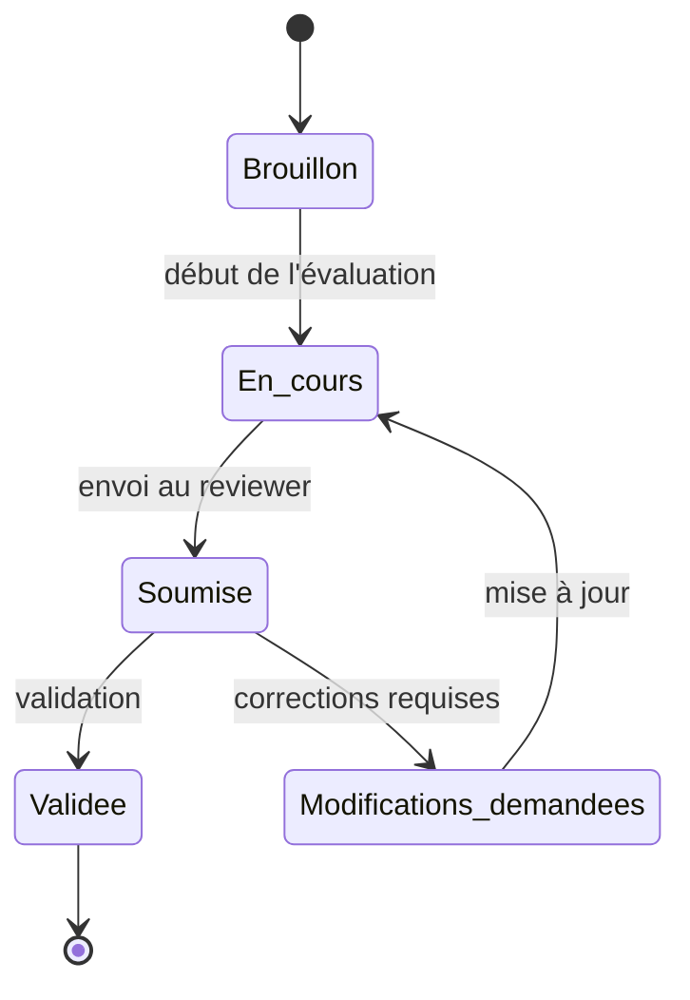
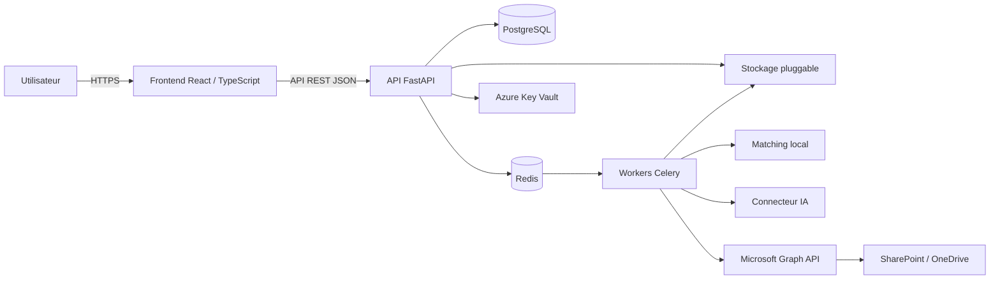

<div align="center">

# Best Practices Colas

### Plateforme de Peer Review Power BI

**Centraliser les contrôles, fiabiliser les validations et assurer la traçabilité des bonnes pratiques BI.**

[](https://github.com/dataphil971/Best_Practices_Colas)
[-7C3AED?style=flat-square)](https://github.com/dataphil971/Best_Practices_Colas)
[](#statut-du-projet)
[](./Spec_Backend_PR_Review.md)
[](#fonctionnalités-clés)

</div>

> [!IMPORTANT]
> Le dépôt contient un **prototype d'interface exécutable dans le navigateur**, un **backend FastAPI consolidé et testable** (lots 1 à 7), une **spécification backend détaillée** et un **volet exploratoire « agent BI »** décrit plus bas. Il ne constitue pas encore une application prête pour un déploiement en production.

---

## Sommaire

- [Pourquoi ce projet ?](#pourquoi-ce-projet-)
- [Le projet en un coup d'œil](#le-projet-en-un-coup-dœil)
- [Fonctionnalités clés](#fonctionnalités-clés)
- [Volet exploratoire : agent BI local](#volet-exploratoire--agent-bi-local)
- [Parcours d'une revue](#parcours-dune-revue)
- [Architecture cible](#architecture-cible)
- [Stack technique](#stack-technique)
- [Structure du dépôt](#structure-du-dépôt)
- [Lancer le prototype](#lancer-le-prototype)
- [Lancer le backend](#lancer-le-backend)
- [Roadmap](#roadmap)
- [Sécurité et gouvernance](#sécurité-et-gouvernance)
- [Documentation](#documentation)
- [Contribution](#contribution)
- [Auteur et licence](#auteur-et-licence)

---

## Pourquoi ce projet ?

La revue qualité de projets Power BI peut rapidement devenir difficile à piloter lorsqu'elle repose sur plusieurs fichiers Excel, des échanges dispersés et différentes versions d'un même référentiel.

**Best Practices Colas** propose un parcours centralisé permettant de :

- évaluer un livrable Power BI à partir d'un référentiel commun ;
- identifier rapidement les écarts, les risques et les actions correctives ;
- partager une revue avec un reviewer identifié ;
- historiser les décisions et les validations ;
- conserver la version exacte des règles appliquées à chaque revue ;
- préparer l'import et le rapprochement de données depuis Excel, SharePoint ou OneDrive.

### Principe structurant : le versionnement immuable

Une revue conserve un **snapshot de la version des règles utilisée lors de sa création**. Une modification ultérieure du référentiel n'altère donc pas l'historique des anciennes revues.

Ce mécanisme garantit :

- la cohérence des résultats dans le temps ;
- l'auditabilité des contrôles ;
- la traçabilité des évolutions du référentiel.

---

## Le projet en un coup d'œil

| Élément | État actuel |
|---|---|
| Prototype de l'interface de Peer Review | ✅ Disponible au format HTML |
| Parcours de navigation et de revue | ✅ Démontrable localement |
| Spécification technique backend | ✅ Version 1.2 documentée |
| Backend FastAPI consolidé (lots 1 à 7) | ✅ Arborescence unique, versionnée fichier par fichier |
| Migrations Alembic reproductibles | ✅ 6 migrations (`0001` → `0006`) |
| Données d'initialisation du référentiel | ✅ Seed JSON (Power BI, App BI, Build) |
| Configuration Docker Compose de développement | ✅ `docker compose up --build` |
| Fichier `.env.example` sans secret | ✅ Présent |
| Tests automatisés (pytest) | ✅ 7 suites de tests |
| Volet exploratoire « agent BI » local | 🟡 Incrément 0 (starter .NET + overlay) |
| Frontend React/TypeScript autonome | ⏳ Cible future (le prototype HTML tient lieu de maquette) |
| Intégration continue (GitHub Actions) | ⏳ Cible future |
| Déploiement Azure de production | ⏳ Cible future |

### Utilisateurs visés

| Rôle | Responsabilité principale |
|---|---|
| **Utilisateur / auteur** | Créer, compléter et soumettre une revue |
| **Reviewer** | Examiner une revue partagée, commenter et valider |
| **Administrateur** | Gérer les règles, les rôles, les connecteurs et l'audit |

---

## Fonctionnalités clés

### 1. Gestion des revues

- création et suivi d'une revue ;
- évaluation de chaque règle avec les statuts `OK`, `KO`, `Partiel`, `Non applicable` ou `Non renseigné` ;
- calcul d'un score de conformité ;
- ajout de commentaires, risques et solutions correctives ;
- suivi d'un plan de remédiation avec responsable et date cible ;
- recherche, tri, filtrage et export Excel.

### 2. Référentiel versionné

- gestion de plusieurs checklists : Power BI, App BI et Build ;
- proposition, approbation ou rejet de nouvelles règles ;
- création de versions immuables ;
- conservation de l'historique complet ;
- retrait et restauration sans suppression définitive ;
- journal d'activité du référentiel.

### 3. Validation tierce

- soumission d'une revue à un ou plusieurs reviewers ;
- commentaires globaux ou rattachés à un point de contrôle ;
- validation, refus ou demande de modifications ;
- nouveau cycle de soumission après correction ;
- limitation de l'accès aux seules revues explicitement partagées.

### 4. Import intelligent

- import manuel de fichiers Excel ;
- analyse et rapprochement avec le référentiel ;
- préremplissage des statuts ;
- détection des correspondances ambiguës ;
- validation humaine des cas incertains ;
- traitement asynchrone des imports volumineux ;
- synchronisation planifiée depuis SharePoint ou OneDrive.

### 5. Connecteurs configurables

- moteur de matching local basé sur `rapidfuzz` ;
- connecteurs IA interchangeables : Mistral, IA interne, OpenAI ou Azure OpenAI ;
- stockage pluggable : Azure Blob, Amazon S3, MinIO ou stockage interne ;
- changement du fournisseur actif sans modification du cœur applicatif ;
- solution de repli locale lorsque l'IA est indisponible.

---

## Volet exploratoire : agent BI local

Une piste en cours d'exploration vise à **détecter et corriger automatiquement** certaines bonnes pratiques directement sur le modèle sémantique ouvert dans Power BI Desktop, puis à **pré-remplir une revue** dans la plateforme.

Le principe : un petit agent local (loopback, `127.0.0.1`) se connecte au modèle via l'onglet **Outils externes** de Power BI Desktop, l'analyse en lecture seule, propose un plan de corrections classées par risque, applique uniquement les corrections sûres après validation, puis publie une revue rattachée aux versions de règles exactes utilisées.

> [!NOTE]
> Ce volet est au stade **incrément 0** : il valide la chaîne « navigateur ↔ agent ↔ Power BI Desktop » avant d'investir dans un moteur de règles complet. L'agent réel ne fonctionne que sur **Windows avec Power BI Desktop** (le client TOM/AMO est spécifique à Windows). En l'absence d'agent, l'overlay du prototype bascule automatiquement en **mode démonstration** — aucune écriture n'est effectuée.

Deux fichiers matérialisent ce volet dans le dépôt :

| Fichier | Rôle |
|---|---|
| `pbi-agent-overlay-v2.js` | Couche d'interface injectée dans le prototype (détection de l'agent, appairage, plan de corrections, dry-run, application, rollback, publication de revue). N'altère pas le bundle existant et suit le thème jour/nuit. |
| `agent-starter-increment0.zip` | Starter .NET minimal de l'agent local : point de santé `/api/v1/health`, appairage cross-origin, connexion TOM réelle **en lecture seule stricte**, et son manifeste d'outil externe Power BI. |

Principes de sûreté retenus pour ce volet : écoute strictement en loopback, appairage explicite (code affiché dans la fenêtre de l'agent), opérations classées **faible / moyen / élevé** avec les opérations à risque élevé exclues de toute application en lot, revalidation avant écriture, sauvegarde et rollback, et aucune donnée métier transmise à l'interface (métadonnées uniquement).

---

## Parcours d'une revue



| État technique | Description |
|---|---|
| `draft` | La revue vient d'être créée |
| `in_progress` | La revue est en cours de remplissage |
| `submitted` | La revue a été soumise pour validation |
| `validated` | La revue a été validée |
| `changes_requested` | Des corrections ont été demandées |

<details>
<summary><strong>Voir les rôles et permissions détaillés</strong></summary>

<br>

| Fonctionnalité | Utilisateur | Reviewer | Administrateur |
|---|:---:|:---:|:---:|
| Créer et compléter ses revues | ✅ | ✅ | ✅ |
| Consulter ses propres revues | ✅ | ✅ | ✅ |
| Consulter une revue partagée | ✅ | ✅ | ✅ |
| Consulter toutes les revues | ❌ | ❌ | ✅ |
| Proposer une règle | ✅ | ✅ | ✅ |
| Valider ou refuser une revue | ❌ | ✅ | ✅ |
| Approuver ou rejeter une règle | ❌ | ❌ | ✅ |
| Retirer ou restaurer une règle | ❌ | ❌ | ✅ |
| Gérer les utilisateurs et les rôles | ❌ | ❌ | ✅ |
| Configurer l'IA, le stockage et SharePoint | ❌ | ❌ | ✅ |
| Consulter le journal complet d'activité | ❌ | ❌ | ✅ |

> Un reviewer accède uniquement aux revues qui lui ont été explicitement partagées ou soumises.

</details>

---

## Architecture cible



### Principes d'architecture

- le frontend consomme exclusivement l'API ;
- les autorisations sont contrôlées côté serveur ;
- les traitements longs sont délégués à des workers asynchrones ;
- les secrets restent hors du code et du frontend ;
- les fournisseurs d'IA et de stockage sont interchangeables ;
- un moteur local reste disponible comme solution de repli ;
- les actions sensibles sont enregistrées dans un journal d'audit.

<details>
<summary><strong>Voir le modèle de données</strong></summary>

<br>

Les principales entités, présentes dans `app/models/`, sont :

- `users` ;
- `categories` ;
- `rules` et `rule_versions` ;
- `reviews` et `review_items` ;
- `validations` et `validation_item_comments` ;
- `share_links` et `share_targets` ;
- `audit_log` et `rule_activity` ;
- `import_jobs` ;
- `integration_config`.

Une règle possède une identité stable dans `rules` et plusieurs versions immuables dans `rule_versions`. Chaque revue référence directement les versions utilisées au moment de sa création.

</details>

---

## Stack technique

| Couche | Technologies |
|---|---|
| Frontend | React, TypeScript, TanStack Query *(cible ; le prototype HTML tient lieu de maquette)* |
| API | Python 3.12, **FastAPI 0.115**, **Pydantic 2** |
| Base de données | **PostgreSQL 16** |
| ORM et migrations | **SQLAlchemy 2**, **Alembic** |
| Authentification | Microsoft Entra ID, OIDC (`authlib`, `httpx`) |
| Authentification de repli | Email, mot de passe, **Argon2id** ; JWT applicatifs |
| Traitements asynchrones | Celery, Redis *(cible)* |
| Import Excel | openpyxl |
| Matching local | rapidfuzz, PostgreSQL `pg_trgm` |
| Intelligence artificielle | Mistral, IA interne, OpenAI, Azure OpenAI |
| Stockage | Azure Blob, Amazon S3, MinIO, stockage interne |
| Gestion des secrets | Azure Key Vault |
| Intégration Microsoft | Microsoft Graph API |
| Volet agent BI | .NET, client Analysis Services (TOM/AMO) — **Windows uniquement** |
| Conteneurisation | Docker, Docker Compose |
| Hébergement cible | Azure Container Apps ou AKS |

> Certaines briques (Celery/Redis, frontend React, déploiement Azure) sont des **cibles d'architecture** et ne sont pas encore consolidées sur la branche principale.

---

## Structure du dépôt

```text
Best_Practices_Colas/
├── README.md
├── PR_Review_PowerBI_avec_agent_v2.html   # prototype d'interface + overlay agent BI
├── pbi-agent-overlay-v2.js                # overlay agent BI (couche indépendante)
├── agent-starter-increment0.zip           # starter .NET de l'agent local (incrément 0)
├── Spec_Backend_PR_Review.md              # spécification backend (Markdown)
├── Spec_Backend_PR_Review.html            # spécification backend (HTML)
└── pr_review_backend/
    └── pr_review_backend/
        ├── app/                           # code applicatif (api, models, schemas, services…)
        ├── alembic/                       # migrations 0001 → 0006
        ├── tests/                         # suites pytest
        ├── docker-compose.yml
        ├── Dockerfile
        ├── requirements.txt
        ├── .env.example
        └── README.md                      # guide de démarrage du backend
```

| Élément | Description |
|---|---|
| `PR_Review_PowerBI_avec_agent_v2.html` | Prototype exécutable de l'interface de Peer Review, avec l'overlay de l'agent BI intégré |
| `pbi-agent-overlay-v2.js` | Overlay de l'agent BI, réutilisable dans une autre build |
| `agent-starter-increment0.zip` | Starter .NET de l'agent local (health, appairage, connexion TOM en lecture seule) |
| `Spec_Backend_PR_Review.md` / `.html` | Spécification technique backend |
| `pr_review_backend/` | Backend FastAPI consolidé, testable et conteneurisé |

---

## Lancer le prototype

Le prototype est autonome : aucun serveur backend n'est nécessaire pour consulter l'interface. En l'absence d'agent BI local, l'overlay fonctionne en mode démonstration (aucune écriture réelle).

### 1. Cloner le dépôt

```bash
git clone https://github.com/dataphil971/Best_Practices_Colas.git
cd Best_Practices_Colas
```

### 2. Ouvrir l'interface

#### Windows PowerShell

```powershell
Start-Process .\PR_Review_PowerBI_avec_agent_v2.html
```

#### Linux

```bash
xdg-open PR_Review_PowerBI_avec_agent_v2.html
```

#### macOS

```bash
open PR_Review_PowerBI_avec_agent_v2.html
```

Le fichier peut également être ouvert directement depuis l'explorateur de fichiers avec un navigateur moderne. Si le double-clic est bloqué en raison de la taille du fichier, un petit serveur statique lève la restriction :

```bash
python3 -m http.server 8080
# puis ouvrir http://localhost:8080/PR_Review_PowerBI_avec_agent_v2.html
```

---

## Lancer le backend

Le backend dispose d'une configuration Docker Compose de développement.

```bash
cd pr_review_backend/pr_review_backend
cp .env.example .env          # renseigner si besoin (Entra ID facultatif en dev)
docker compose up --build
```

L'API applique les migrations puis démarre sur `http://localhost:8000`.
Documentation interactive (Swagger) : `http://localhost:8000/docs`.

Voir [`pr_review_backend/pr_review_backend/README.md`](./pr_review_backend/pr_review_backend/README.md) pour le détail (migrations, seed du référentiel, création du compte administrateur, exécution des tests).

---

## Roadmap

### Réalisé

- [x] Prototype du parcours de Peer Review — MVP 1.0.0
- [x] Spécification backend v1.2 (architecture, sécurité, RBAC, modèle de données, endpoints REST)
- [x] Backend FastAPI consolidé dans une arborescence unique (lots 1 à 7)
- [x] Migrations Alembic reproductibles et seed du référentiel
- [x] Fichier `.env.example` sans secret et configuration Docker Compose de développement
- [x] Suites de tests automatisées (pytest)
- [x] Volet exploratoire agent BI — overlay + starter .NET (incrément 0)
- [x] Suivi du thème jour/nuit par l'overlay de l'agent

### Prochaines priorités

- [ ] Développer le frontend React/TypeScript autonome
- [ ] Configurer l'intégration continue avec GitHub Actions
- [ ] Documenter le démarrage complet frontend + backend de bout en bout
- [ ] Ajouter des captures d'écran ou une démonstration du prototype
- [ ] Poursuivre l'agent BI : snapshot complet, graphe de dépendances, premières règles réelles
- [ ] Préparer le déploiement Azure et le monitoring

<details>
<summary><strong>Voir le découpage fonctionnel des lots</strong></summary>

<br>

| Lot | Périmètre principal |
|---|---|
| **Lot 1** | Fondations, PostgreSQL, migrations, authentification Entra ID et RBAC |
| **Lot 2** | Référentiel versionné, approbation, retrait, restauration et historique |
| **Lot 3** | Gestion des revues, score de conformité, commentaires et remédiations |
| **Lot 4** | Partage ciblé, validation tierce et cycle de resoumission |
| **Lot 5** | Import Excel, matching local, préremplissage et stockage pluggable |
| **Lot 6** | Connecteurs IA configurables et mécanisme de repli local |
| **Lot 7** | Microsoft Graph, SharePoint, OneDrive et synchronisation planifiée |
| **Lot 8** | Monitoring, audit, tests de charge et durcissement de la sécurité |

</details>

---

## Sécurité et gouvernance

L'architecture prévoit notamment :

- une authentification Microsoft Entra ID ;
- un contrôle d'accès RBAC côté serveur ;
- des tokens à durée de vie limitée ;
- un hachage Argon2id pour l'authentification de repli ;
- des requêtes SQL paramétrées ;
- une validation stricte des fichiers importés ;
- une protection contre l'injection de formules Excel ;
- un stockage des secrets dans Azure Key Vault ;
- une journalisation des actions sensibles ;
- TLS, HSTS, CORS restrictif, protection CSRF et rate limiting ;
- une rétention configurable des fichiers importés ;
- une minimisation des données envoyées aux fournisseurs d'IA.

Pour le volet agent BI : écoute loopback exclusive, appairage explicite, opérations à risque élevé exclues de toute application en lot, sauvegarde et rollback, et métadonnées uniquement (aucune donnée métier transmise).

### Confidentialité du dépôt

Ne jamais versionner :

- un mot de passe, un jeton, une clé API ou une chaîne de connexion ;
- un fichier `.env` réel ;
- un fichier Power BI ou Excel contenant des données confidentielles ;
- des informations personnelles non anonymisées ;
- des captures, documents ou informations internes non autorisés à la publication.

> [!WARNING]
> Ce dépôt étant public, chaque fichier doit être vérifié avant publication. Le projet doit rester un prototype technique sans données métier confidentielles ni secrets d'entreprise.

---

## Documentation

- [Spécification backend — Markdown](./Spec_Backend_PR_Review.md)
- [Spécification backend — HTML](./Spec_Backend_PR_Review.html)
- [Guide de démarrage du backend](./pr_review_backend/pr_review_backend/README.md)
- [Prototype Peer Review Power BI](./PR_Review_PowerBI_avec_agent_v2.html)

---

## Contribution

### Workflow recommandé

```bash
# Mettre la branche principale à jour
git switch main
git pull origin main

# Créer une branche dédiée
git switch -c docs/nom-de-la-modification

# Vérifier et enregistrer les changements
git status
git add README.md
git commit -m "docs: improve project README"

# Publier la branche
git push -u origin docs/nom-de-la-modification
```

Ouvrir ensuite une Pull Request vers `main` en décrivant :

- le contenu de la modification ;
- sa raison ;
- son impact ;
- les vérifications réalisées.

### Convention de commits suggérée

- `docs:` documentation ;
- `feat:` nouvelle fonctionnalité ;
- `fix:` correction ;
- `refactor:` restructuration sans changement fonctionnel ;
- `test:` ajout ou modification de tests ;
- `chore:` maintenance technique.

---

## Statut du projet

**Best Practices Colas est actuellement un prototype / MVP en cours d'industrialisation.**

Les parcours fonctionnels, l'architecture cible et la stratégie backend sont documentés, le backend est consolidé et testable, et un volet exploratoire d'agent BI local est amorcé. Les prochaines étapes consistent principalement à développer le frontend, automatiser l'intégration continue, et préparer un déploiement reproductible.

Ce dépôt présente un travail de conception et de prototypage ; il ne constitue pas une publication officielle ni une solution de production validée.

---

## Auteur et licence

Projet développé et documenté par **[dataphil971](https://github.com/dataphil971)**.

- Dépôt : [dataphil971/Best_Practices_Colas](https://github.com/dataphil971/Best_Practices_Colas)
- Licence : aucune licence open source n'est actuellement définie.

En l'absence de fichier `LICENSE`, tous les droits restent réservés à l'auteur du dépôt. Toute réutilisation ou diffusion doit respecter le contexte du projet et les règles de confidentialité applicables.
